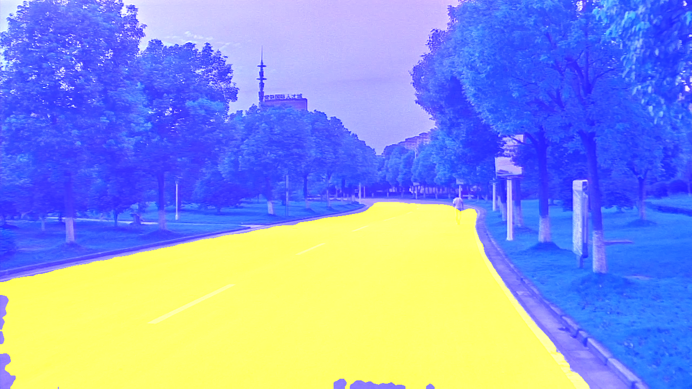
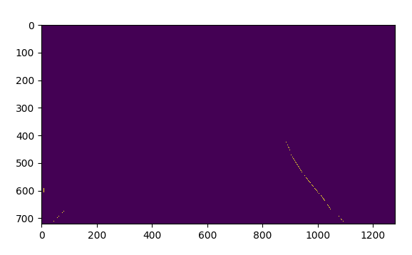
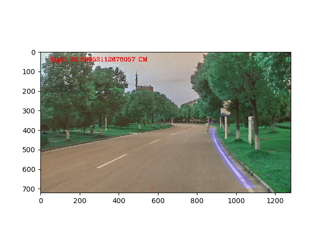
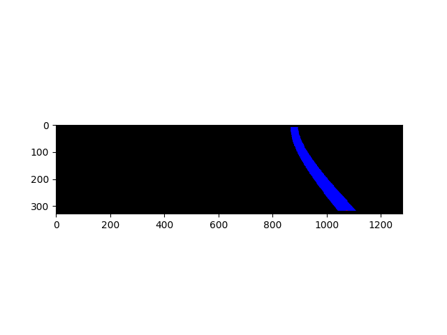

# Cslg SelfCar Vision

## Files
/data
> 存放图像数据、model等的数据目录
- checkpoint,model.ckpt,model.ckpt.meta:fcn的模型文件
- img.jpg,line.jpg:用于测试的样例图片
- vgg16.npy:训练好的vgg16权重

---
/DrivingZoneDetection
> 行驶区域感知

/DrivingZoneDetection/RoadBoundaryDetection
> 利用vgg16迁移学习初始化FCN模型参数,语义分割道路，通过canny、hough过滤出道路右边界的轮廓
- /DrivingZoneDetection/RoadBoundaryDetection/fcn8_vgg.py:fcn网络架构
- /DrivingZoneDetection/RoadBoundaryDetection/fcn_pred.py:包含FCNRoad类，预测单张图像、视频的道路像素点

- /DrivingZoneDetection/RoadBoundaryDetection/filter_lane.py:包含FilterLane类，canny+hough+slope_filter，过滤出道路右边界轮廓


/DrivingZoneDetection/CalculateOffset
> 基于FCN的预测结果的车辆偏移计算
- /DrivingZoneDetection/Calculate   Offset/camera_cal:存放计算相机畸变系数的棋盘图片
- /DrivingZoneDetection/CalculateOffset/calibration.py:计算相机畸变系数
- /DrivingZoneDetection/CalculateOffset/lane_offset.py:包含Lane类，基于FCN识别结果并过滤出右车道线的基础上计算车辆偏移车道中心线的距离信息
- /DrivingZoneDetection/CalculateOffset/line.py:包含Line类，用于存放寻找道路边界的线的数据，包括线上各点的坐标、线的下端起始x、线的曲率、线的多项式系数
- /DrivingZoneDetection/CalculateOffset/m_utils.py:包含上一个车道线感知版本的车道线二值化模块，还添加了将车道线识别结果与原图像融合模块（见下图）

- /DrivingZoneDetection/CalculateOffset/utils.py:在二值化的车道线感知图像中寻找车道线


/DrivingZoneDetection/Message
- __init__.py:包含Message类，用于打印调试信息和通讯模块.(未使用)

/DrivingZoneDetection/app.py
> 启动程序的主入口，包含了AppLane类，类中的main方法接收img或者video来启动程序

/DrivingZoneDetection/config.py
> 用于初始化、获取、修改程序的配置属性

/DrivingZoneDetection/settings.conf
> 存储程序配置信息的文件

---


## location parameter
```buildoutcfg
[fcn]
vgg16_npy_path = /media/n6-301/workspace/CslgSelfCar_vision/data/vgg16.npy
cp_file = /media/n6-301/workspace/CslgSelfCar_vision/data/model.ckpt

[offset]
roi_y_top = 380
roi_y_bottom = 12
road_width_real = 546
road_width_img = 994
calib_img_path = /media/n6-301/workspace/CslgSelfCar_vision/DrivingZoneDetection/CalculateOffset/camera_cal/calibration*.jpg
```